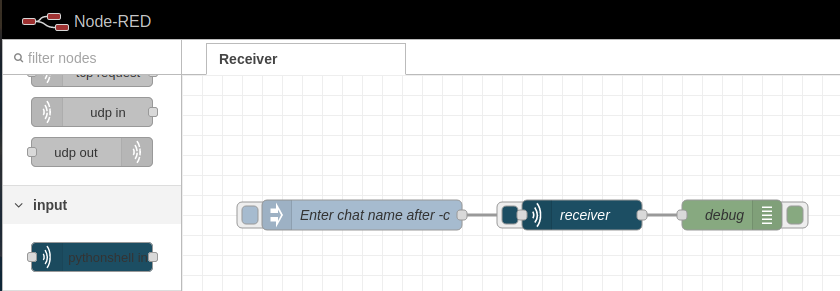
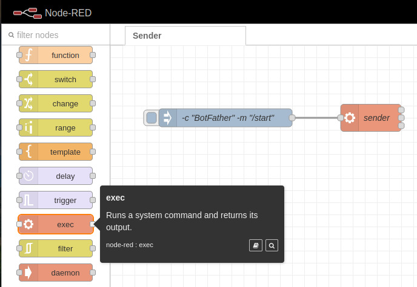

Simple implementation python receiver and sender blocks for Node-RED.
Use python 3.12 and telethon to send and receive text messages for your automation.

# How to install

1. Install python 3.12 on your device.
```
sudo apt install software-properties-common -y
sudo add-apt-repository ppa:deadsnakes/ppa
sudo apt install python3.12
```

2. Install python3.12-venv
```
sudo apt install python3.12-venv
```

3. Select a folder and create the environment
```
cd ~/telegram_node_red
python3.12 -m venv .venv
```

4. Activate your environment
```
source ~/telegram_node_red/.venv/bin/activate
```

5. Copy files from git to your folder

6. Install dependencies
```
pip install -r requirements.txt
```

7. Rename from `.env_example` to `.env` and add your telethon credentials
in .env file:
```
api_id=99999999
api_hash=99ee9ee9ee99999ee999999999e9999e
```
For more information, please check
https://docs.telethon.dev/en/stable/basic/signing-in.html

**Don't show your credentials to anyone**

6. Install `node-red-contrib-pythonshell` node in your Node-RED.
This component uses in receiver's scripts, because this scripts doesn't end.
Exec node doesn't work in this case.


# How to use

**First start with Telegram includes authorization**.

Therefore you need run script directly and enter phone number and verification code.
Do this running next code and after that interrupt it (Ctrl+C):

```
python receiver_all.py 
```

After that you get `anon.session` file in your folder.

**Node-RED**

Receive text from one chat




Send message `-m` to chat `-c`



If you want to use and receiver and sender in one flow you need to use
several environments (see `How to install`)

**More examples**

> See more information in [examples folder](./examples).
